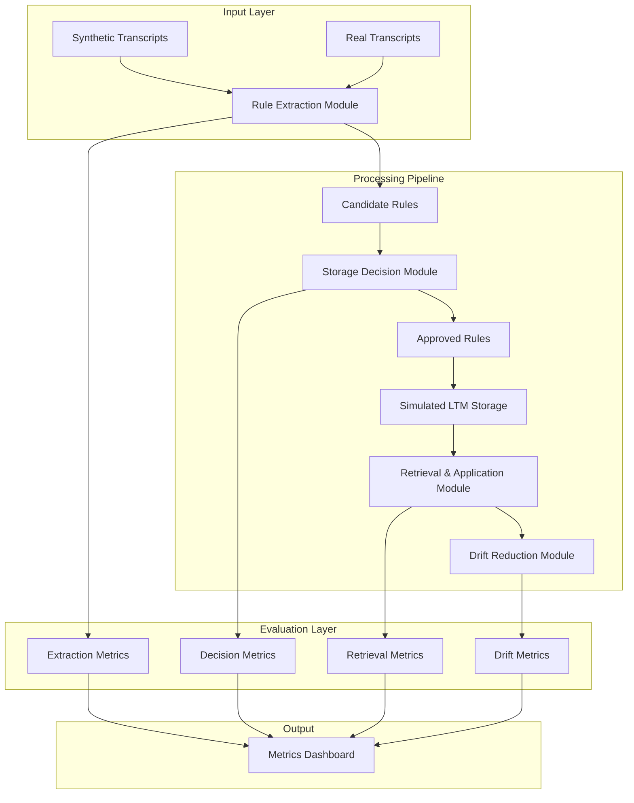
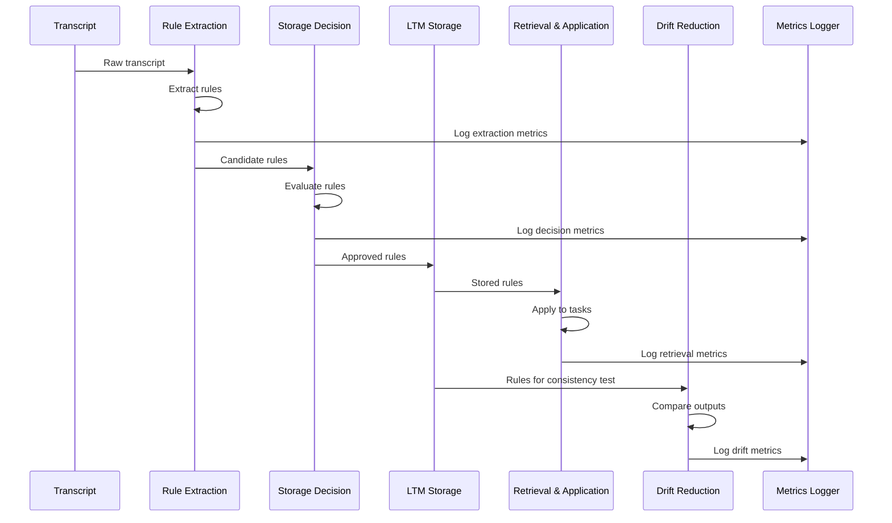

# LTM Validation Pipeline Architecture

## Overview
This pipeline validates Phase 1 of a Long-Term Memory (LTM) system for a coding assistant through four independent test stages.

## Architecture Diagram



## Module Structure

### 1. Rule Extraction Module (`rule_extraction/`)
- **Purpose**: Extract candidate rules from transcripts
- **Input**: JSON transcripts with mixed content
- **Output**: Structured rules with match_criteria, action, and rationale
- **Metrics**: Precision, Recall, F1 Score

### 2. Storage Decision Module (`storage_decision/`)
- **Purpose**: Decide which rules to store in LTM
- **Input**: Candidate rules from extraction
- **Output**: Storage decisions with justifications
- **Metrics**: Agreement rate with ground truth

### 3. Retrieval & Application Module (`retrieval_application/`)
- **Purpose**: Test rule retrieval and application
- **Input**: Stored rules and test tasks
- **Output**: Application results
- **Metrics**: Retrieval accuracy, over-application rate

### 4. Drift Reduction Module (`drift_reduction/`)
- **Purpose**: Measure consistency improvements
- **Input**: Repeated tasks with/without rules
- **Output**: Consistency comparisons
- **Metrics**: Drift reduction percentage

## Data Flow



## Directory Structure

```
Roo-Code-Experiments/
├── ltm_pipeline/
│   ├── __init__.py
│   ├── rule_extraction/
│   │   ├── __init__.py
│   │   ├── extractor.py
│   │   ├── models.py
│   │   └── evaluator.py
│   ├── storage_decision/
│   │   ├── __init__.py
│   │   ├── decision_maker.py
│   │   ├── criteria.py
│   │   └── evaluator.py
│   ├── retrieval_application/
│   │   ├── __init__.py
│   │   ├── ltm_storage.py
│   │   ├── retriever.py
│   │   ├── applicator.py
│   │   └── evaluator.py
│   ├── drift_reduction/
│   │   ├── __init__.py
│   │   ├── consistency_checker.py
│   │   ├── task_runner.py
│   │   └── evaluator.py
│   ├── common/
│   │   ├── __init__.py
│   │   ├── models.py
│   │   ├── metrics.py
│   │   └── logger.py
│   └── utils/
│       ├── __init__.py
│       ├── data_generator.py
│       └── file_io.py
├── data/
│   ├── synthetic/
│   │   ├── transcripts/
│   │   ├── ground_truth/
│   │   └── test_tasks/
│   └── results/
│       └── metrics/
├── tests/
│   ├── unit/
│   ├── integration/
│   └── fixtures/
├── scripts/
│   ├── run_pipeline.py
│   ├── generate_data.py
│   └── evaluate_results.py
├── docs/
│   ├── README.md
│   ├── USAGE.md
│   └── API.md
├── requirements.txt
└── setup.py
```

## Key Design Decisions

1. **Modular Independence**: Each module can run standalone with JSON input/output
2. **Configurable Pipeline**: Modules can be chained or run individually
3. **Versioned Data**: All synthetic data includes version tags for reproducibility
4. **Comprehensive Logging**: Every operation logs with timestamp, version, and context
5. **Metric Aggregation**: Central metrics collection for cross-module analysis

## Data Models

### Rule Structure
```python
{
    "id": "rule_001",
    "match_criteria": {
        "type": "pattern|keyword|context",
        "value": "specific matching condition"
    },
    "action": {
        "type": "style|naming|structure",
        "description": "what to do"
    },
    "rationale": "why this rule exists",
    "metadata": {
        "source": "transcript_id",
        "confidence": 0.95,
        "timestamp": "2025-01-05T12:00:00Z"
    }
}
```

### Transcript Structure
```python
{
    "id": "transcript_001",
    "segments": [
        {
            "speaker": "user|assistant",
            "content": "text content",
            "type": "rule|chatter|instruction",
            "timestamp": "2025-01-05T12:00:00Z"
        }
    ],
    "metadata": {
        "session_id": "session_001",
        "duration": 1800,
        "tags": ["persistent_rule", "short_term", "chatter"]
    }
}
```

## Evaluation Metrics

1. **Rule Extraction**
   - Precision: Correct extractions / Total extractions
   - Recall: Correct extractions / Total ground truth rules
   - F1 Score: Harmonic mean of precision and recall

2. **Storage Decision**
   - Agreement Rate: Matching decisions / Total decisions
   - False Positive Rate: Incorrect stores / Total stores
   - False Negative Rate: Missed stores / Total should-store

3. **Retrieval & Application**
   - Retrieval Accuracy: Correct retrievals / Total relevant rules
   - Application Precision: Correct applications / Total applications
   - Over-application Rate: Unnecessary applications / Total opportunities

4. **Drift Reduction**
   - Consistency Score: Similarity between repeated runs
   - Drift Reduction %: (Drift_without - Drift_with) / Drift_without * 100
   - Style Adherence: Matching style patterns / Total style checks