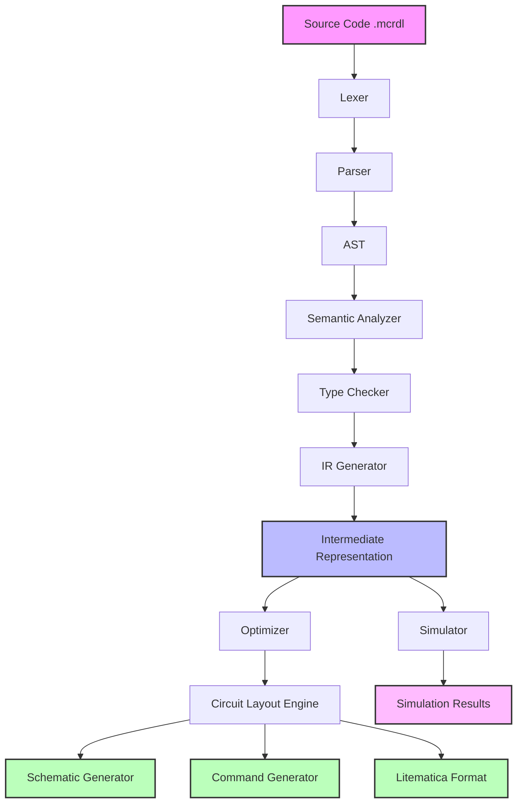

# Minecraft Redstone HDL - Architecture Document

## Project Overview

The Minecraft Redstone Hardware Description Language (MCRDL) is a text-based programming language designed to describe, simulate, and generate Minecraft redstone circuits. Similar to hardware description languages like Verilog or VHDL, MCRDL allows users to define complex redstone contraptions using high-level abstractions.

## Language Design Philosophy

1. **Declarative**: Describe what the circuit should do, not how to build it block by block
2. **Modular**: Support for reusable components and hierarchical design
3. **Type-Safe**: Strong typing for redstone signals and components
4. **Simulatable**: Test circuits before building them in Minecraft
5. **Optimizable**: Automatic circuit optimization for space and timing

## Core Components

### 1. Language Syntax

The language uses a C-like syntax with hardware description extensions:

```mcrdl
// Example: Simple AND gate module
module AndGate {
    input wire a, b;
    output wire result;
    
    assign result = a & b;
}

// Example: Clock generator
module Clock {
    parameter PERIOD = 4;  // Redstone ticks
    output reg pulse;
    
    always {
        pulse = 1;
        delay(PERIOD/2);
        pulse = 0;
        delay(PERIOD/2);
    }
}

// Example: Counter with reset
module Counter {
    input wire clock, reset;
    output reg[4:0] count;  // 5-bit counter
    
    always @(posedge clock or posedge reset) {
        if (reset) {
            count = 0;
        } else {
            count = count + 1;
        }
    }
}
```

### 2. Type System

#### Primitive Types
- `wire`: Single redstone signal (0-15 strength)
- `reg`: Stateful signal (memory element)
- `bus[n]`: Multi-bit signal bus
- `analog`: Comparator analog signal (0-15)

#### Component Types
- **Power Sources**
  - `redstone_block`: Constant power source
  - `redstone_torch`: Invertible power source
  - `lever`: Player-controlled switch
  - `button`: Temporary pulse generator
  - `pressure_plate`: Entity-activated switch
  - `observer`: Block update detector
  - `daylight_detector`: Light-level sensor
  - `sculk_sensor`: Vibration detector
  - `target`: Projectile detector
  - `trapped_chest`: Container interaction detector
  - `tripwire_hook`: String-based detector
  - `detector_rail`: Minecart detector
  - `lectern`: Book page detector
  - `lightning_rod`: Lightning detector

- **Transmission Components**
  - `redstone_dust`: Signal wire
  - `redstone_repeater`: Signal delay and diode
  - `redstone_comparator`: Signal comparison and subtraction

- **Mechanism Components**
  - `piston`: Block mover
  - `sticky_piston`: Block puller/pusher
  - `dispenser`: Item dispenser
  - `dropper`: Item dropper
  - `hopper`: Item transfer
  - `door`: Openable barrier
  - `fence_gate`: Openable fence
  - `trapdoor`: Vertical door
  - `note_block`: Sound generator
  - `jukebox`: Music player
  - `bell`: Sound and particle generator
  - `rail`: Minecart track
  - `powered_rail`: Accelerating track
  - `activator_rail`: Minecart activator
  - `tnt`: Explosive
  - `command_block`: Command executor
  - `structure_block`: Structure saver/loader
  - `redstone_lamp`: Light source
  - `copper_bulb`: Toggleable light
  - `crafter`: Automatic crafting

### 3. Module System

```mcrdl
// Module definition with parameters
module Multiplexer #(parameter WIDTH = 8) {
    input wire[WIDTH-1:0] a, b;
    input wire select;
    output wire[WIDTH-1:0] out;
    
    assign out = select ? b : a;
}

// Module instantiation
module TopLevel {
    wire[7:0] data1, data2, result;
    wire control;
    
    Multiplexer #(.WIDTH(8)) mux1 (
        .a(data1),
        .b(data2),
        .select(control),
        .out(result)
    );
}
```

### 4. Timing Model

```mcrdl
// Timing constraints and delays
module TimedCircuit {
    input wire trigger;
    output reg response;
    
    always @(posedge trigger) {
        delay(4);  // 4 redstone ticks (0.4 seconds)
        response = 1;
        delay(2);
        response = 0;
    }
}
```

## System Architecture



## Compiler Pipeline

### 1. Lexical Analysis (Lexer)
- Tokenizes source code into lexemes
- Handles comments, whitespace, and preprocessor directives
- Generates token stream with position information

### 2. Syntax Analysis (Parser)
- Builds Abstract Syntax Tree (AST)
- Validates syntax according to grammar rules
- Reports syntax errors with line/column information

### 3. Semantic Analysis
- Type checking and inference
- Module dependency resolution
- Signal width matching
- Timing constraint validation

### 4. Intermediate Representation (IR)
- Circuit graph representation
- Component connectivity matrix
- Timing dependency graph
- Power flow analysis

### 5. Optimization Passes
- Dead code elimination
- Constant propagation
- Circuit minimization
- Timing optimization
- Power efficiency optimization

### 6. Code Generation

#### Schematic Output
- Generate .schematic files (MCEdit/WorldEdit format)
- Generate .litematic files (Litematica mod)
- Generate structure block NBT data

#### Command Output
- Generate /setblock commands
- Generate /fill commands for bulk placement
- Generate function files for datapacks

#### Simulation Output
- Interactive circuit visualization
- Signal propagation animation
- Timing diagram generation
- Power consumption analysis

## Standard Library

### Basic Gates
```mcrdl
library std.gates {
    module NOT { ... }
    module AND { ... }
    module OR { ... }
    module XOR { ... }
    module NAND { ... }
    module NOR { ... }
    module XNOR { ... }
}
```

### Arithmetic
```mcrdl
library std.arithmetic {
    module HalfAdder { ... }
    module FullAdder { ... }
    module RippleCarryAdder #(WIDTH) { ... }
    module Subtractor #(WIDTH) { ... }
    module Multiplier #(WIDTH) { ... }
    module Comparator #(WIDTH) { ... }
}
```

### Memory
```mcrdl
library std.memory {
    module DFlipFlop { ... }
    module TFlipFlop { ... }
    module RSLatch { ... }
    module Register #(WIDTH) { ... }
    module RAM #(ADDR_WIDTH, DATA_WIDTH) { ... }
    module ROM #(ADDR_WIDTH, DATA_WIDTH) { ... }
}
```

### Timing
```mcrdl
library std.timing {
    module Clock #(PERIOD) { ... }
    module PulseGenerator #(WIDTH) { ... }
    module Debouncer { ... }
    module EdgeDetector { ... }
    module Synchronizer { ... }
}
```

## CLI Tool Interface

```bash
# Compile MCRDL to schematic
mcrdl compile input.mcrdl -o output.schematic

# Simulate circuit
mcrdl simulate input.mcrdl --time 100 --format vcd

# Generate Minecraft commands
mcrdl generate input.mcrdl --format commands --origin "~10 ~0 ~10"

# Optimize circuit
mcrdl optimize input.mcrdl --target size --level 3

# Validate circuit
mcrdl check input.mcrdl --timing --power

# Interactive REPL
mcrdl repl
```

## File Structure

```
redstone-hdl/
├── src/
│   ├── lexer/           # Tokenization
│   ├── parser/          # AST generation
│   ├── analyzer/        # Semantic analysis
│   ├── ir/              # Intermediate representation
│   ├── optimizer/       # Optimization passes
│   ├── generator/       # Code generation
│   ├── simulator/       # Circuit simulation
│   └── cli/             # Command-line interface
├── stdlib/              # Standard library modules
│   ├── gates/
│   ├── arithmetic/
│   ├── memory/
│   └── timing/
├── examples/            # Example circuits
├── tests/               # Test suite
├── docs/                # Documentation
└── tools/               # Additional tools
```

## Implementation Languages

- **Core Compiler**: Rust (for performance and safety)
- **Simulator**: Rust with WebAssembly support for browser-based simulation
- **Visualization**: TypeScript/React for web-based circuit viewer
- **CLI**: Rust with clap for command parsing

## Testing Strategy

1. **Unit Tests**: Each compiler component
2. **Integration Tests**: Full compilation pipeline
3. **Simulation Tests**: Verify circuit behavior
4. **Performance Tests**: Optimization effectiveness
5. **Compatibility Tests**: Minecraft version compatibility

## Future Enhancements

1. **Visual Editor**: Drag-and-drop circuit designer
2. **Minecraft Mod Integration**: Direct in-game compilation
3. **Cloud Compilation**: Web-based compiler service
4. **Circuit Library**: Community-shared components
5. **AI-Assisted Design**: ML-based circuit optimization
6. **Real-time Collaboration**: Multi-user circuit design